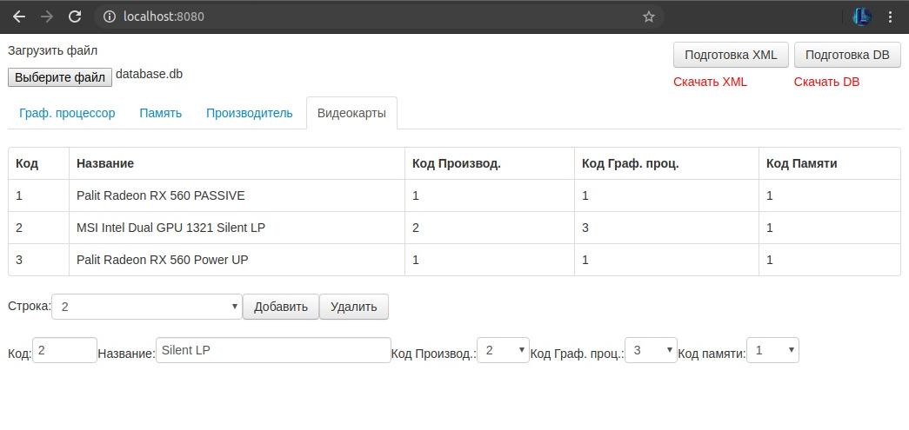

# Задание по ООП (веб интерфейс)
Данный проект представляет из себя программу с веб интерфейсом написанную на С++ с использованием WT, SQLite3 и TinyXML. Проект не использует схему MVC. Использует файлы проекта https://github.com/Lucors/ooptask-appconsole/ 
***
Схема бд описана в файле "tablesScheme.txt". Примеры xml и db файлов на чтение находятся в директории "datafiles".
***
Ниже представлен пример работы:  
  
[Видеофрагмент](https://www.youtube.com/watch?v=39A0twLvKpg&feature=youtu.be)
